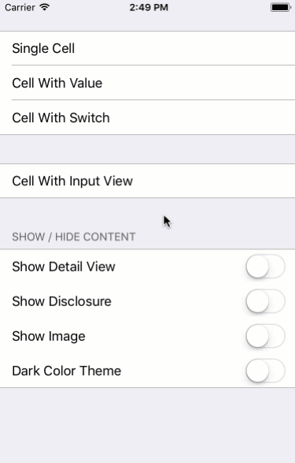
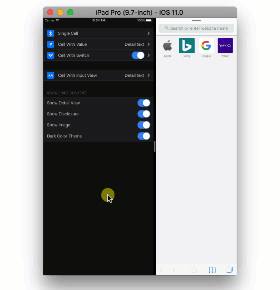
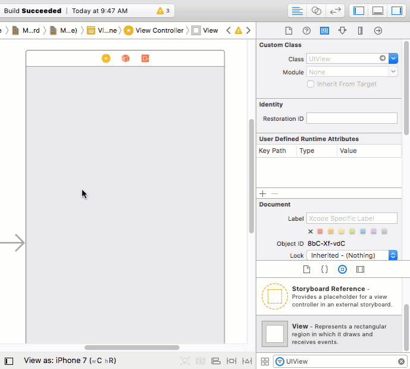

# SingleCell, standalone UITableViewCell-like controls for iOS

A family of custom iOS `UIControls` that simulate appearance of `UITableViewCell`, but can be used by their own, as single controls, without `UITableView`. One SingleCell comprises of a main label, optional image on the left and optional detail view on the right. Also, it can show disclosure icon on the right side.

There are different subclasses of SingleCell that you can use:
- **SwitchSingleCell** – adds UISwitch control on the right side of the cell (on the place of detailView).

- **ValueSingleCell** – adds UILabel on the right side.

- **InputSingleCell** – extends ValueSingleCell class by allowing to set an input view for editing of the detail label text.

Using SingleCell controls allows to speed up development of the user interface.




Layout of all sub-views is provided by layout constraints. Thus, SingleCell can be used to build Auto Layout interfaces that support different screen sizes, orientations and Split Screen mode.


## Requirements
- iOS 9.0+
- Xcode 8.0+

## Installation
Use `CocoaPods` and add SingleCell to your `Podfile`:
```ruby
pod 'SingleCell', '~> 1.0.0'
```

Or install manually by copying everything from SingleCell/ directory into your Xcode project.

## How to use

SingleCell is defined as `@IBDesignable` and have `@IBInspectable` properties. It can be rendered and configured directly in Interface Builder.

1. Add UIView in your storyboard or nib file. In Inspector set custom class to `'SingleCell'`. If using Pods, then do not forget to change class' module to `'SingleCell'` as well, otherwise Interface Builder fails to render the control.

2. Add layout constraints to position the cell view. Cell's sub-views are laid out automatically and there is no need set constraints for them. You can control their appearance (hide sub-views or change space between them) via custom properties in Inspector.

3. SingleCell is highly customizable: you can change texts, images, borders, colors, spaces, etc. See all the custom properties in Inspector.

    Note: You can set common configuration for all SingleCell classes. See code documentation for the `SingleCell.Defaults` class.

    

4) To have access to the control properties from a code, create outlets in your controllers, the same way as for standard UI controls.

5) To subscribe on control events, add target-action connections the same way as for standard UI controls. See code documentation for which events are exposed.

To look at an example of how to use SingleCell, see the [Demo project](SingleCell-Demo/).

## Licence

SingleCell is released under the MIT license.
